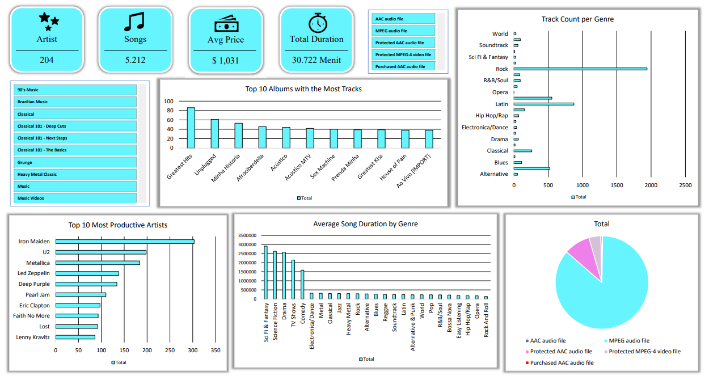

# 🎵 Music Store Catalog & Track Analysis

## 📌 Project Overview
Proyek ini merupakan analisis komprehensif terhadap *database* katalog toko musik digital. Proses pengerjaan melibatkan penarikan dan penggabungan data relasional dari berbagai tabel menggunakan **SQL**, yang kemudian diekspor dan divisualisasikan secara interaktif menggunakan **Microsoft Excel**. Tujuan utama *dashboard* ini adalah untuk memahami distribusi genre, produktivitas artis, dan karakteristik durasi media.

## 🛠️ Tools & Skills
* **Database Extraction:** SQL (JOINs, Aggregation, Data Extraction)
* **Data Visualization:** Microsoft Excel (Pivot Tables, Slicers, Dashboarding)
* **Skills:** Exploratory Data Analysis (EDA), Catalog Management, Data Storytelling.

## 📊 Dashboard Visualization

## 💡 Key Insights & Findings
Berdasarkan visualisasi katalog musik di atas, ditemukan beberapa *insight* menarik:
1. **Skala Katalog:** Toko ini memiliki koleksi yang cukup besar dengan total **5.212 lagu** dari **204 artis**. Rata-rata harga per trek adalah **$1,03**, dengan total durasi keseluruhan katalog mencapai **30.722 Menit**.
2. **Dominasi Genre Rock:** Pada grafik *Track Count per Genre*, **Rock** mendominasi secara absolut dengan jumlah trek mendekati angka 2.000, mengalahkan genre lain seperti Latin dan Metal dengan selisih yang sangat jauh.
3. **Artis Paling Produktif:** **Iron Maiden** memimpin grafik artis paling produktif dengan kontribusi lebih dari 300 trek di dalam katalog, disusul oleh U2 dan Metallica.
4. **Distribusi Format Media:** Sebagian besar file yang dijual menggunakan format **MPEG audio file** (porsi warna *cyan* terbesar pada *Pie Chart*), yang menunjukkan standar distribusi audio utama di toko ini.
5. **Anomali Durasi Konten:** Grafik *Average Song Duration by Genre* mengungkap bahwa toko ini tidak hanya menjual musik. Kategori seperti *Sci Fi & Fantasy, Science Fiction, Drama,* dan *TV Shows* memiliki rata-rata durasi jutaan milidetik, yang mengindikasikan bahwa toko ini juga mendistribusikan konten **Video/Film**.

---
*Silakan unduh file Excel yang tersedia di repository ini untuk mengeksplorasi filter interaktif pada dashboard.*
